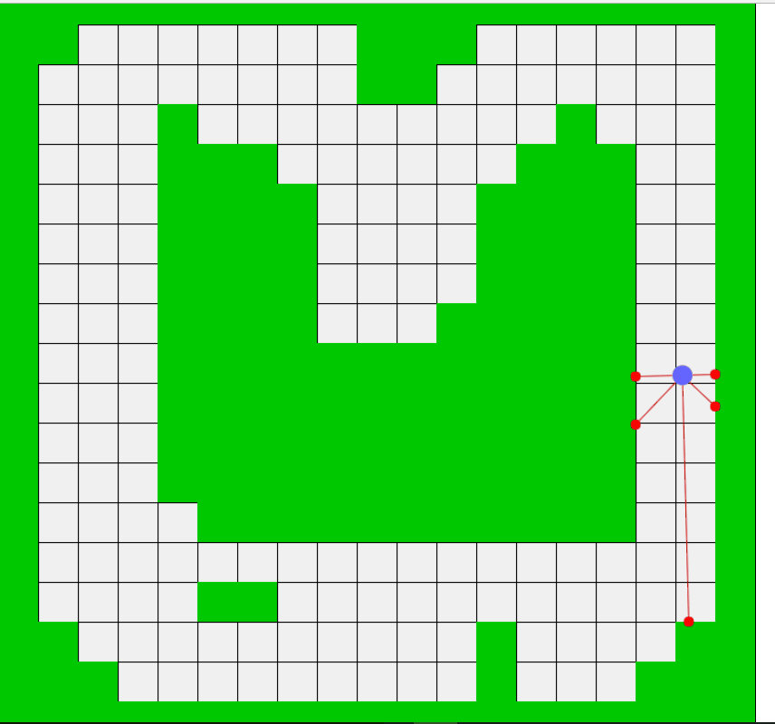

# Sensors
Machine learning project with neural networks



Levels are generated using https://www.mter.pl/level-editor/

## Install dependencies

```
yarn
```

## Start application in watch mode

```
yarn start
```

## Build application

```
yarn build
```
