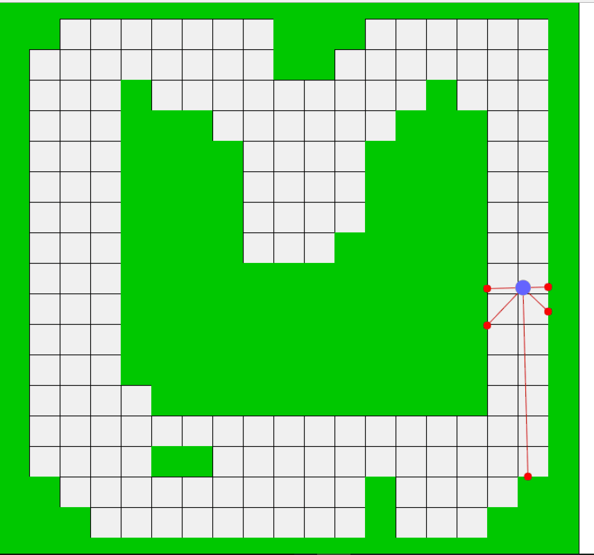

# Sensors

Machine learning project that utilizes neural networks and evolutionary algorithm



Levels were generated using https://www.mter.pl/level-editor

## Setup scripts

### Install dependencies

```bash
npm i
```

### Start application in watch mode

```bash
npm start
```

### Build application

```bash
npm run build
```

### Run tests

```bash
npm test
```
